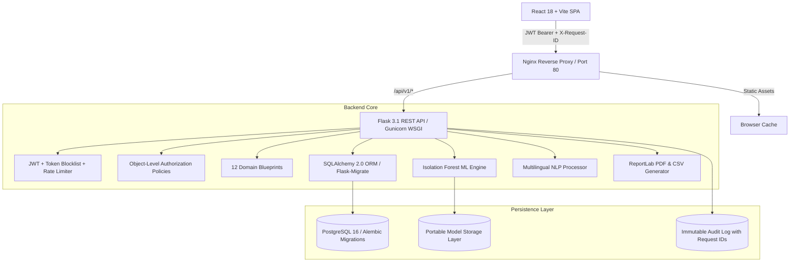

# PolicyLens AI — Financial Risk Intelligence & Anomaly Platform

[](https://github.com/policylens/policylens-ai/actions)
[](https://www.python.org/)
[](https://reactjs.org/)
[](https://vitejs.dev/)
[](https://www.docker.com/)

**PolicyLens AI** is a production-hardened financial risk intelligence, anomaly detection, and case management platform designed for public finance oversight, audit management, and citizen grievance triaging. It leverages unsupervised machine learning (Isolation Forest) paired with explainable hybrid risk scoring and human-in-the-loop workflow governance.

---

## 🏛️ System Architecture



---

## 🚀 Core Capabilities

### 1. Machine Learning & Explainable Risk Engine
- **Unsupervised Isolation Forest**: Evaluates multi-dimensional feature space (`allocation`, `utilization`, `utilization_rate`, `delay_days`, `transaction_count`).
- **Feature Attribution & Baselines**: Calculates median and standard deviation per feature cohort; explains why a record isolated (e.g., *depressed absorption + 31-day processing delay*).
- **Hybrid Risk Scoring**: Weighted composite of ML anomaly score (40%), domain rule violations (25%), and historical regional peer deviation (35%).
- **Portable Artifact Storage**: Model artifacts use portable relative keys (`models/IF/{version_tag}/model.joblib`), resolved through a configurable storage adapter rather than developer-specific filesystem paths.

### 2. Multi-Lingual Natural Language Processing (NLP)
- **Grievance Triage**: Citizen and whistleblower complaint analysis supporting English, Hindi (Devanagari), and Hinglish (Latin transliteration).
- **Signal Extraction**: Auto-classifies category (Infrastructure, Health, Education, Procurement), detects sentiment, assigns urgency level (`High`, `Medium`, `Low`), and calculates confidence score.

### 3. Object-Level & Role-Based Authorization (BOLA/IDOR Defense)
- Server-side authorization enforced via reusable policy guards (`can_view_case`, `can_edit_case`, `can_download_report`, `can_view_complaint`, `can_edit_financial_record`):
  - **Admin**: Full system administration, user roles, model retraining, system settings, and audit logs.
  - **Manager**: Department oversight, CSV import approvals, and case triaging.
  - **Analyst**: Financial records inspection, anomaly scans, case creation, and report generation.
  - **Reviewer**: Assigned case investigation, evidence documentation, and status resolutions.
  - **Auditor**: Compliance inspection, audit trail verification, and report download.

### 4. Canonical Case Management State Machine
- Standardized lifecycle transitions:
  `NEW` → `ASSIGNED` → `UNDER REVIEW` → `NEEDS INFORMATION` → `ESCALATED` → `RESOLVED` → `CLOSED`
- Direct arbitrary status jumps by non-admins are rejected with `INVALID_STATE_TRANSITION`.
- Mandatory resolution explanation required when moving to `RESOLVED` or `CLOSED`.
- Every transition automatically appends an immutable `CaseEvent` audit record.

### 5. Official Auditable Reporting
- Generates real **CSV** and **PDF** reports (via `reportlab`) with collision-safe IDs (`RPT-YYYYMMDD-XXXXXX`).
- Enforces server-side download authorization and creates notification events upon completion.

### 6. Rate Limiting & Auth Hardening
- Rate limiting implemented via `Flask-Limiter` on sensitive endpoints (login, registration, password change, token refresh, report generation, CSV imports).
- Short-lived access tokens (15 minutes) with rotating refresh tokens (7 days).
- Token revocation table (`TokenBlocklist`) for logout and password change invalidation.

---

## 🔑 Demo Access Credentials

The demo database includes pre-seeded roles:

| Role | Email Address | Password | Permissions Scope |
| :--- | :--- | :--- | :--- |
| **Admin** | `admin@policylens.demo` | `Admin@1234` | Full platform & model administration |
| **Manager** | `anshi@policylens.demo` | `Manager@1234` | Case triaging & CSV data imports |
| **Analyst** | `rajesh@policylens.demo` | `Analyst@1234` | Anomaly scans & financial record inspection |
| **Reviewer** | `priya@policylens.demo` | `Reviewer@1234` | Investigation case resolution & note logs |
| **Auditor** | `vikram@policylens.demo` | `Auditor@1234` | Compliance reporting & immutable audit review |

---

## 🛠️ Local Development Setup

### Prerequisites
- Python 3.12+
- Node.js 20+ & npm

### 1. Backend Setup

```bash
cd backend

# Create virtual environment
python -m venv .venv
source .venv/bin/activate  # On Windows: .venv\Scripts\activate

# Install dependencies
pip install -r requirements.txt pytest

# Run database migrations
flask db upgrade

# Seed demo dataset (users, records, initial ML model)
python scripts/seed.py

# Run development server (Port 5000)
python run.py
```

### 2. Frontend Setup

```bash
cd frontend

# Install dependencies
npm install

# Run Vite dev server with proxy to backend (Port 5173)
npm run dev
```

Visit **`http://localhost:5173`** in your browser.

---

## 🐳 Docker Production Deployment

Run the complete multi-container production stack (PostgreSQL + Flask/Gunicorn + Nginx/React):

```bash
# Ensure required environment variables are exported:
export POSTGRES_PASSWORD="YourStrongPostgresPassword"
export JWT_SECRET_KEY="YourSecure32ByteRandomKeyHere"

# Launch stack
docker-compose up --build -d
```

- **Web Application**: `http://localhost`
- **Backend API**: `http://localhost/api/v1/`
- **Health Check**: `http://localhost/health`
- **Readiness Check**: `http://localhost/ready`

To stop the containers:
```bash
docker-compose down
```

---

## 🧪 Automated Test Suite

Run the full backend test suite covering authentication, RBAC, BOLA, financial queries, ML pipeline, case workflows, report generation, and CSV imports:

```bash
cd backend
python -m pytest tests/ -v
```

**Test Suites:**
- `test_auth.py`: Login, logout, JWT refresh, session recovery, duplicate email prevention, RBAC restrictions.
- `test_password_and_auth_hardening.py`: Password change verification, token blocklist revocation, refresh token rotation.
- `test_financial.py`: Pagination, search, regional filtering, record detail, CSV export.
- `test_cases.py`: Case creation, legal state transitions, illegal transition rejection, resolution requirements, BOLA protection.
- `test_complaints.py`: Multi-lingual NLP classification (English, Hindi, Hinglish), grievance updates.
- `test_reports.py`: CSV and PDF generation via ReportLab, list reports, download verification, unauthorized download protection.
- `test_imports.py`: CSV bulk parsing, zero-value preservation, JSON error storage, duplicate avoidance without N+1 queries.
- `test_admin_settings.py`: Canonical dictionary contract (`{"settings": {"key": "value"}}`), PATCH updates, RBAC enforcement.
- `test_health_and_audit.py`: Public liveness/readiness probes, sanitized database errors, `X-Request-ID` correlation tracing.
- `test_ml.py`: Feature extraction matrix, Isolation Forest training, anomaly inference, explainability generation.

---

## 📋 Canonical API Index

All endpoints require JWT Bearer authentication unless noted otherwise:

- **Auth** (`/api/v1/auth`): `/login`, `/register`, `/me`, `/refresh`, `/logout`, `/change-password` (PATCH)
- **Dashboard** (`/api/v1/dashboard`): `/summary` (computed KPIs, regional breakdown, trendlines)
- **Financial Records** (`/api/v1/financial-records`): `/` (GET, POST), `/<id>` (GET, PATCH, DELETE), `/export`, `/regions`
- **Anomalies** (`/api/v1/anomalies`): `/analyze` (POST), `/latest`, `/<id>`, `/models`, `/runs`, `/train` (POST)
- **Cases** (`/api/v1/cases`): `/` (GET, POST), `/<id>` (GET, PATCH), `/<id>/events` (GET, POST)
- **Complaints** (`/api/v1/complaints`): `/` (GET, POST), `/<id>` (GET, PATCH)
- **Regions** (`/api/v1/regions`): `/` (Geospatial statistics)
- **Reports** (`/api/v1/reports`): `/` (GET, POST), `/<id>`, `/<id>/download` (GET)
- **Imports** (`/api/v1/imports`): `/upload` (POST), `/<id>/confirm` (POST), `/` (GET)
- **Notifications** (`/api/v1/notifications`): `/`, `/unread-count`, `/<id>/read`, `/mark-all-read`
- **Admin** (`/api/v1/admin`): `/users`, `/users/<id>`, `/audit-logs`, `/settings` (GET, PATCH)
- **Health** (`/health`, `/ready`): Public liveness and sanitized readiness probes

---

## 🔒 Security Best Practices Implemented
- **No Hardcoded Fallbacks**: Eradicated all fabricated business metrics (`0.742`, `0.120`). Real data drives all UI states.
- **BOLA / IDOR Defense**: Granular server-side object authorization checks before any record modification or report download.
- **Alembic Migrations**: Fully managed database schema evolution through Flask-Migrate; zero reliance on `db.create_all()` in production.
- **Sanitized Readiness**: Diagnostic database failure logs kept server-side; clients receive sanitized status messages without connection strings.
- **Secret Enforcement**: Production configuration strictly validates that `JWT_SECRET_KEY` is present and $\ge$ 32 bytes.
- **Request Tracing**: End-to-end `X-Request-ID` correlation across requests and immutable audit logs.
- **Client Resilience**: Global React `ErrorBoundary`, non-blocking accessible `ToastContext`, and zero browser `alert()` popups.
